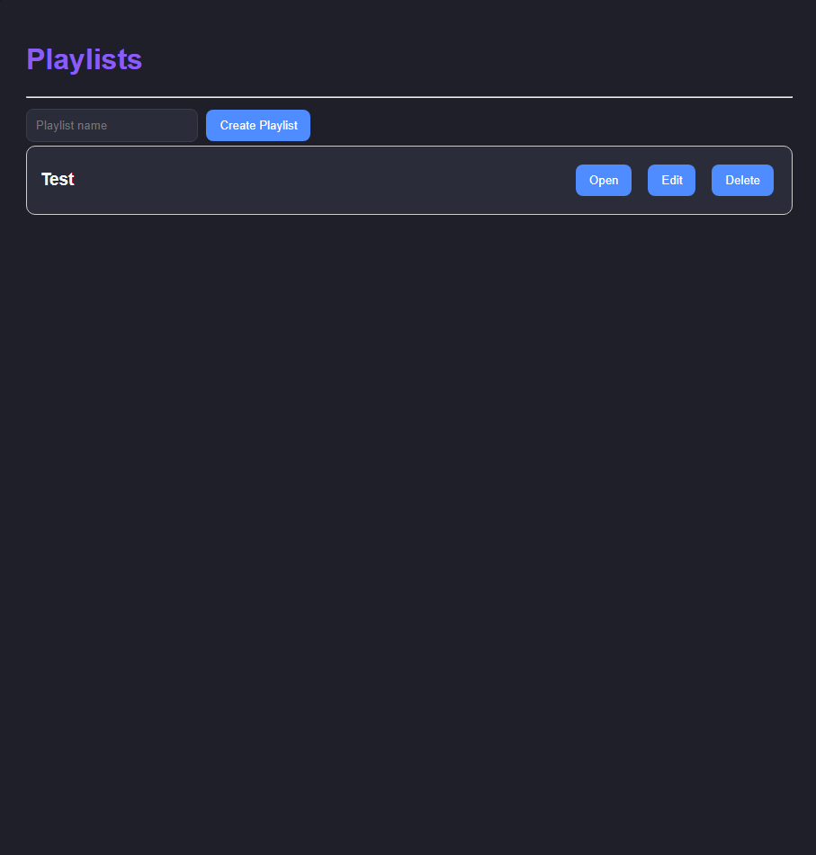
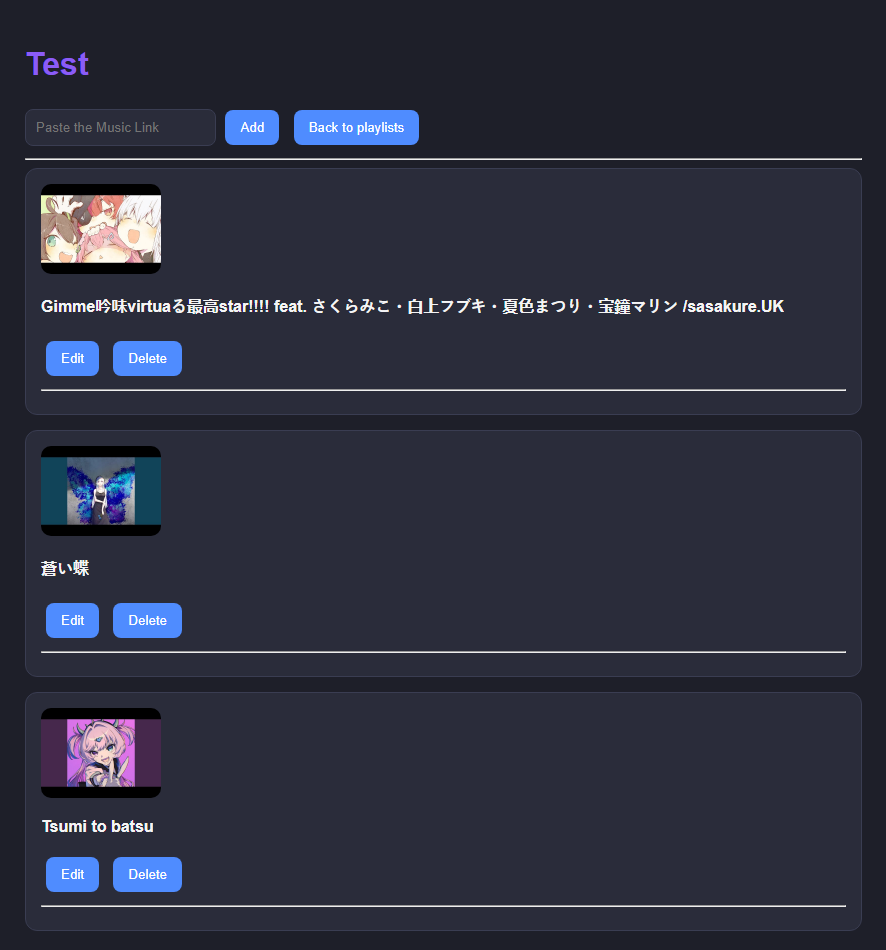

# 🎵 MusiView

MusiView é uma aplicação web para gerenciamento de playlists musicais desenvolvida com Java, Spring Boot e JavaScript.

O projeto permite criar playlists, adicionar músicas através de links do YouTube e organizar sua biblioteca musical de forma simples e intuitiva.

---

## 🚀 Funcionalidades

### 📂 Gerenciamento de Playlists

* Criar playlists
* Editar nome de playlists
* Excluir playlists
* Navegar entre playlists

### 🎵 Gerenciamento de Músicas

* Adicionar músicas através de links do YouTube
* Obter automaticamente:

  * título da música
  * thumbnail/capa do vídeo
* Editar:

  * nome da música
  * artista
  * capa personalizada
* Excluir músicas

### 🌐 Integração com YouTube API

Ao adicionar um link do YouTube, o sistema:

1. Detecta a plataforma
2. Extrai o ID do vídeo
3. Consulta a API do YouTube
4. Obtém o título e a thumbnail automaticamente
5. Salva a música na playlist selecionada

---

## 🛠 Tecnologias Utilizadas

### Backend

* Java
* Spring Boot
* Spring Data JPA
* Hibernate
* REST API

### Frontend

* HTML5
* CSS3
* JavaScript (Fetch API)

### Banco de Dados

* JPA/Hibernate
* H2 Database

### APIs

* YouTube Data API v3

---

## 📸 Screenshots

### Tela de Playlists



### Tela de Músicas



---

## 🏗 Estrutura do Projeto

```text
src
├── controller
│   ├── MusicController
│   └── PlaylistController
│
├── service
│   ├── MusicService
│   ├── PlaylistService
│   └── YoutubeService
│
├── repository
│   ├── MusicRepository
│   └── PlaylistRepository
│
├── model
│   ├── Music
│   └── Playlist
│
└── util
    └── LinkUtils
```

---

## 🎮 Como Utilizar

### 1. Criar uma Playlist

Na tela inicial:

* Digite o nome da playlist
* Clique em **Create Playlist**

### 2. Abrir uma Playlist

Clique em **Open** na playlist desejada.

### 3. Adicionar uma Música

Cole um link do YouTube:

```text
https://www.youtube.com/watch?v=XXXXXXXXXXX
```

Clique em **Add**.

O sistema buscará automaticamente:

* Nome do vídeo
* Thumbnail

### 4. Editar uma Música

Clique em **Edit** para alterar:

* Nome
* Artista
* URL da capa

### 5. Excluir uma Música

Clique em **Delete**.

---

## ⚙️ Configuração

### Clonar o projeto

```bash
git clone https://github.com/seu-usuario/musiview.git
```

### Entrar na pasta

```bash
cd musiview
```

### Configurar a chave da API do YouTube

Crie um arquivo:

```properties
src/main/resources/essential.properties
```

Conteúdo:

Por motivos de segurança, a chave da API do YouTube não é incluída no repositório.

Cada usuário deverá criar sua própria chave e configurá-la no arquivo `essential.properties`.

Para criar uma chave da API:
1. Crie uma chave no Google Cloud Console.
2. Ative a YouTube Data API v3.

https://developers.google.com/youtube/v3/getting-started


```properties
youtube.api.key=SUA_CHAVE_AQUI
```

### Executar

```bash
./mvnw spring-boot:run
```

ou

```bash
mvn spring-boot:run
```

---

## 📌 Próximas Funcionalidades

* Sistema de ranking entre músicas
* Upload de imagens para capas personalizadas
* Estatísticas das playlists

---

## 👨‍💻 Objetivo do Projeto

Este projeto foi desenvolvido com foco em aprendizado Full Stack, praticando:

* Desenvolvimento Backend com Spring Boot
* APIs REST
* Banco de Dados Relacional
* Integração com APIs externas
* Manipulação de DOM com JavaScript
* Comunicação Frontend ↔ Backend
* Organização de projetos reais

```
```
